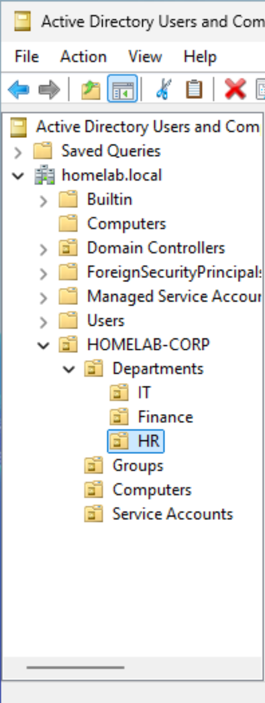
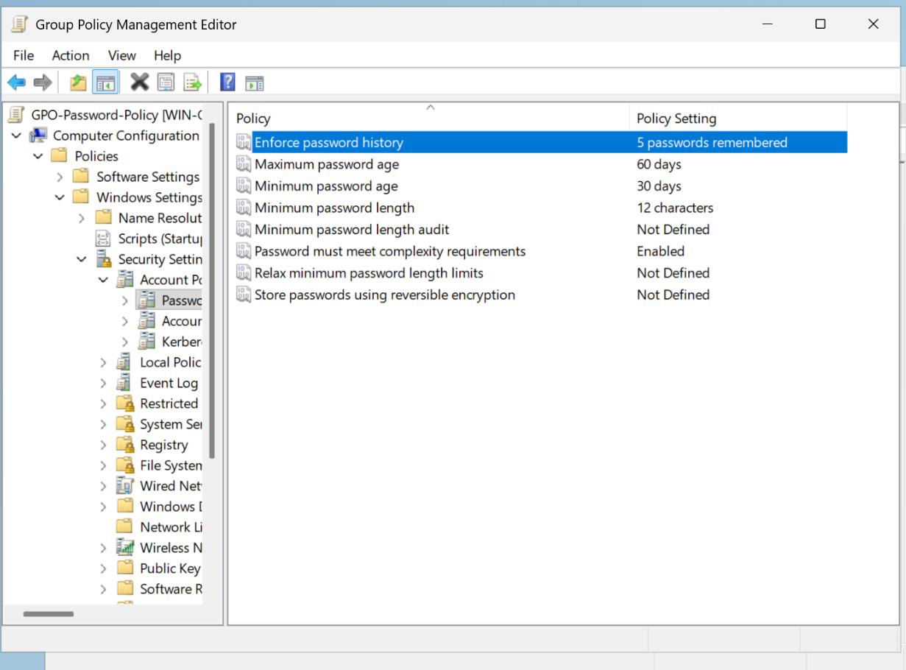
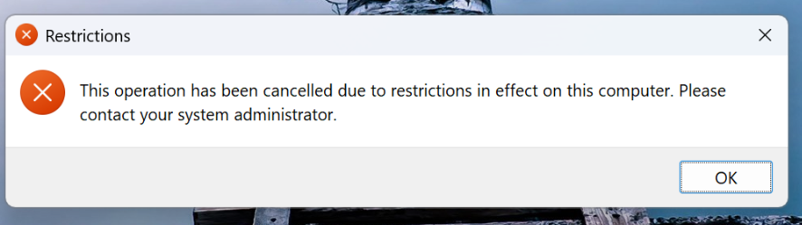
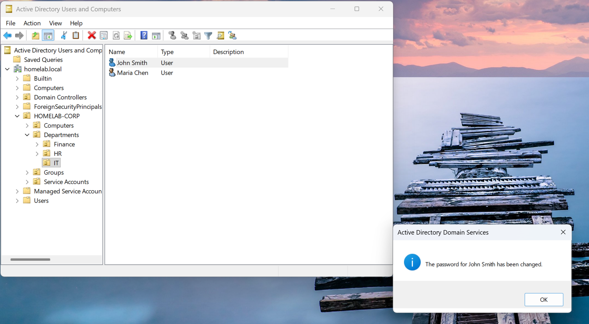
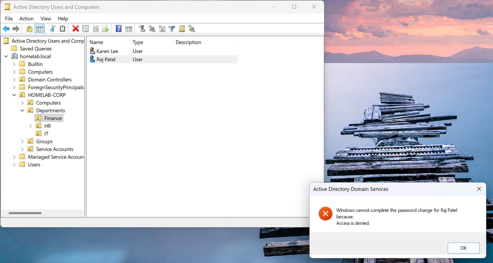
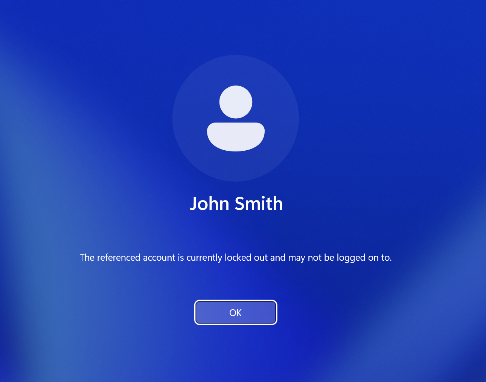
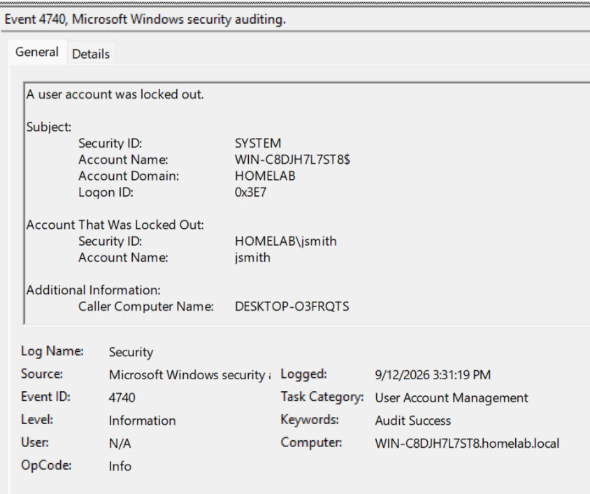

# Active Directory & IAM Security Lab

A hands-on home lab simulating enterprise Identity and Access Management: Active Directory deployment, Group Policy enforcement, role-based access control (RBAC) delegation, and insider-threat detection/response — built and documented end-to-end as part of a cybersecurity portfolio.

**Author:** Ahmed | Security+ | ISC2 CC | TryHackMe Top 1% Global
**Environment:** VMware Workstation, Windows Server 2025, Windows 11 Enterprise, isolated virtual network

---

## 🎯 Objective

Simulate a small organization's Active Directory environment to practice and demonstrate:
- AD DS deployment and domain architecture design
- Organizational Unit (OU) structuring reflecting real departmental boundaries
- Group Policy Objects (GPOs) for password/lockout enforcement and OU-scoped restrictions
- Least-privilege access via delegated RBAC
- Detection and response to a simulated insider-threat / brute-force scenario, using native Windows auditing (Event ID 4740)

## 🧱 Lab Architecture

| VM | Role | OS | Specs |
|---|---|---|---|
| DC01 | Domain Controller / DNS | Windows Server 2025 | 4 vCPU, 8 GB RAM |
| WKS01 | Domain-joined client | Windows 11 Enterprise | 4 vCPU, 8 GB RAM |

- **Domain:** `homelab.local`
- **Network:** Isolated VMware custom network (VMnet2), static IPs (`192.168.38.10` / `.20`)
- **Hypervisor:** VMware Workstation Pro (switched from VirtualBox after a corrupted ISO download — see Challenges section)

## 🗂️ Active Directory Structure

```
homelab.local
└── HOMELAB-CORP
    ├── Departments
    │   ├── IT          (jsmith, mchen)
    │   ├── Finance      (rpatel, klee)
    │   └── HR           (dwilson)
    ├── Groups
    │   ├── IT-Admins
    │   ├── Finance-Staff
    │   ├── HR-Staff
    │   └── Help-Desk-L1
    ├── Computers
    └── Service Accounts
```



## 🔐 Group Policy Objects

| GPO | Scope | Settings |
|---|---|---|
| Default Domain Policy (modified) | Domain-wide | Min password length: 12, complexity enabled, max age: 60 days, history: 5; Lockout threshold: 5 attempts, duration: 15 min |
| GPO-IT-Restrictions | IT OU only | Task Manager disabled, Control Panel/Settings access blocked |

**Note:** account policies (password/lockout) in Active Directory only take effect from the highest-precedence GPO linked at the domain root — a separate custom GPO for these settings is silently overridden by Default Domain Policy. This was discovered during testing (see Challenges) and settings were consolidated into Default Domain Policy per Microsoft's documented guidance.




## 🛡️ RBAC / Delegated Administration

To demonstrate least-privilege access control, limited administrative rights were delegated to a `Help-Desk-L1` security group, scoped only to the `IT` OU:

- **Granted:** Reset user passwords, read user information — for objects inside the `IT` OU only
- **Verified:** `mchen` (Help-Desk-L1 member) successfully reset a password for `jsmith` (IT OU)
- **Verified (negative test):** the same action against `rpatel` (Finance OU) was denied — confirming delegation boundaries are enforced, not just configured




This demonstrates a core IAM principle: permissions delegated in Active Directory are scoped to the container they're granted on, not global — the same account and the same right produce different outcomes depending on where the target object resides in the OU hierarchy.

## 🚨 Insider Threat Simulation & Incident Response

A simulated scenario — repeated failed logon attempts against the `jsmith` account from `WKS01` — was used to validate the account lockout policy and practice a full detect-investigate-remediate cycle.

1. **Trigger:** 5 consecutive failed logon attempts on WKS01
2. **Detection:** Account lockout confirmed via `Get-ADUser -Properties LockedOut`
3. **Investigation:** Windows Security Event Log reviewed on DC01, filtered for Event ID 4740, confirming source computer and timestamp
4. **Remediation:** Account unlocked and verified




📄 **Full mock incident report:** [incident-report.md](./incident-report.md)

## 🧩 Challenges & Troubleshooting

Documenting real problems and fixes, not just a clean happy path:

- **Corrupted VirtualBox ISO** caused repeated boot failures — resolved by switching to VMware Workstation Pro
- **Built-in Administrator account had a blank password**, blocking domain promotion — traced to being logged in under a different local account (`ahmed`) rather than the built-in `Administrator`
- **Static IP typo** (`92.168.38.20` instead of `192.168.38.20`) silently broke connectivity between VMs — caught via `ipconfig /all` review
- **DNS server misconfiguration** (mistyped DNS server address) caused intermittent "server not operational" / DC-locator failures — resolved by correcting the DNS entry
- **Account lockout policy not applying** despite configuration — root cause: a separate custom GPO for account policies was overridden by Default Domain Policy's precedence at the domain root; fixed by consolidating settings into Default Domain Policy directly, per Microsoft's documented behavior for domain account policies

## 🛠️ Tools Used

VMware Workstation Pro · Windows Server 2025 · Windows 11 Enterprise · Active Directory Domain Services · Group Policy Management Console · PowerShell

## 📁 Repository Structure

```
ad-iam-security-lab/
├── README.md
├── incident-report.md
└── screenshots/
```

---

*Part of a broader cybersecurity home lab portfolio. See related projects: SOC & Detection Engineering (Splunk) · Vulnerability Assessment (Nessus/Nmap) · Microsoft Sentinel KQL Detection · Web Application Security Testing · Network & Threat Analysis.*
